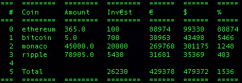

# README
### Info
Name:       Coinviewer<br />
Author:     priintpar<br />
Website:    [https://life-sucks.info/1022/coinviewer-4-2019/](https://github.com/priintpar/coinviewer/)<br />
Date:       05/2019<br />
Version:    4 (190528)<br />
<br />

<br />
### Description
This little tool gives you an overview over<br />
all of your and your families or clients<br />
cryptocoins. You can add unlimited coinholders<br />
and unlimited coins, as long as they are listed<br />
at coinmarketcap.com
<br />
### Sources used are
https://pypi.python.org/pypi/tabulate<br />
### Configuration
Create a csv file named coins.csv<br />
with the following content format:<br />
```
"Coin Name";"Coin Amount";"Total Investment Price in €"
digibyte;5922.7;0.05
bitcoin;47.34;2661.86
```
### How to run
python coinviewer.py coins.csv<br />
### 3rd-party libraries needed to run
sudo pip install tabulate
